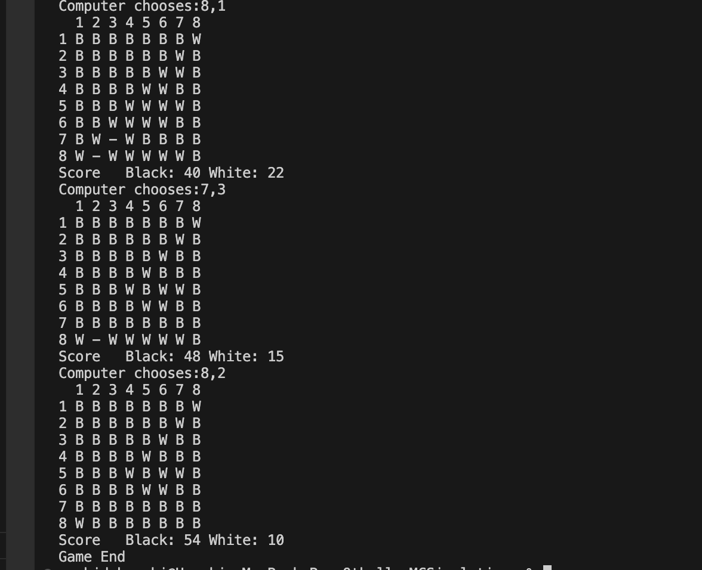

# Othello

## Project Description

In this project, I implemented a text base othello game using C++. The execution looks like below,

The goal of this project is to learn C++ and implement parallelism. The program supports a human playing against a computer player. When deciding how the computer player decides the next move one of the ideas I had that aligns with multithreading was the monte carlo tree search. However, a strict MCTS would not be easily implemented concurrently. In this project, for each possible move, the computer player would run independent simulations from that move and find the move that has the best result. During the simulation, the next move was chosen randomly out of all possible moves. The idea is that the best move will lead to better positions and overall the best move will have better oveall results in the simulation. To run mass simulations effeciently, the simulation was done in parallel with multiple threads. Once this was implemented, I conducted a short experiment to figure out whether this method of simulating the outcome of a game was effective in choosing a better next move.

## How to

Compile the code using C++11

`g++ -std=c++11 -o main othelloGame.cpp othelloBoard.cpp othelloPlayer.cpp`

Once compiled, run the program as follows. Only the first argument is mandatory for the program to execute correctly.

`./main <mode> <nThreads1> <nSimulations1> <nThreads2> <nSimulations2>`

mode = `hvc` (human (Black) vs computer (White)), `cvh` (computer (Black) vs human (White)), `cvc` (computer (Black) vs computer (White))

nThreads1/nSimulations1 = number of threads/Simulation used by the computer player (If hvc or cvh this is the only computer player)

nThreads2/nSimulations2 = for the second player (White). Only valid in the cvc mode

The default number of threads is 1 and the default number of simulations is 100. Setting the number of simulations to 0 will cause the computer player to randomly choose a move instead of running simulations.

## Experiment

For our experiment, we simply used the cvc mode to have computer players with different settings match against each other. To make the playing field even, we had each pair play 20 matches total and distributed black and white evenly between the two. We simply looked at the win ratio between the two pairs

We had a computer player that chooses moves randomly go up against a computer player that runs 100 simulations per next move before choosing a move. We also had a computer player that runs 100 simulations go up against a computer player that runs 1000 simulations.

## Results

With the first pair of players (Random Move versus 100 simulations), the computer player that did 100 simulations had a win rate of 100% over the player that just chose moves randomly.

For the second pair (100 simulations versus 1000 simulations), when the player with 1000 simulations won 7 out of 10 games as white
and 9 out of 10 games as black.

## Analysis

From the first pair's results, it is safe to say that simulating the game before choosing the next move is in fact a valid strategy. We could imagine that a better move would put the player in a better position to win thus producing more winning boards in the game. Now we could also imagine that as we increase the number of simulations, we would rule out the deviation of the random move choosing. We would be able to examine all possible outcomes more evenly thus producing more accurate results that represent the strength of the move. We can see that the player that did more simulations was in fact a better player than the player that did less simulations.

## After Thoughts

Other approaches to choosing the next move could include an alpha beta pruning tree using heuristics. One of the reasons that motivated me to explore the simulation approach was that there could be moves that seem to be bad (with heuristics) but have potential later on to flip the game on its head. I thought that a random simulation would pick up and examine these seemingly "bad" moves.
